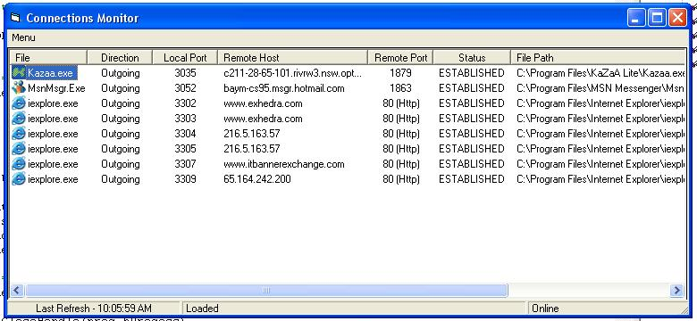



## Connection Monitor \(Firewall\) Updated

### Description

Update to previous submition fixes some freezing problems and a more easier to use format also added system tray icon ability with amazing stability using windows hooks, this update is due to feedback from previous submission, so thanks for your input. 'Next' update will use strickly API calls for netstat :)
 
### More Info
 

             |
---                |---
**Submitted On**   |2003-09-03 10:08:36
**By**             |[JayStacey](https://github.com/Planet-Source-Code/PSCIndex/blob/master/ByAuthor/jaystacey.md)
**Level**          |Intermediate
**User Rating**    |5.0 (25 globes from 5 users)
**Compatibility**  |VB 5\.0, VB 6\.0
**Category**       |[Internet/ HTML](https://github.com/Planet-Source-Code/PSCIndex/blob/master/ByCategory/internet-html__1-34.md)
**World**          |[Visual Basic](https://github.com/Planet-Source-Code/PSCIndex/blob/master/ByWorld/visual-basic.md)
**Archive File**   |[Connection164172952003\.zip](https://github.com/Planet-Source-Code/jaystacey-connection-monitor-firewall-updated__1-48292/archive/master.zip)

